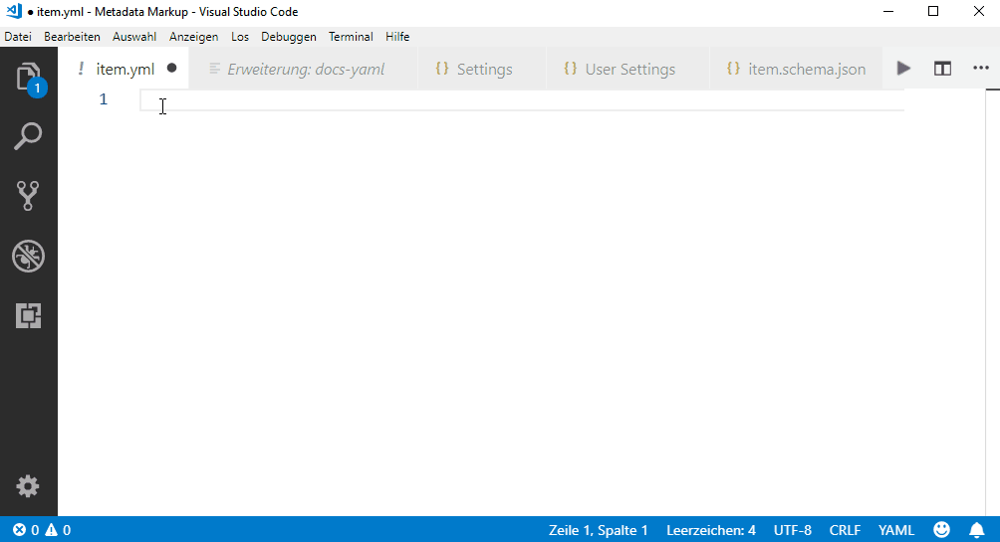
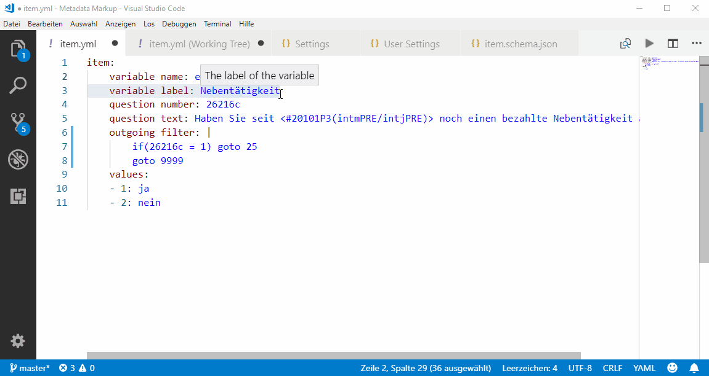
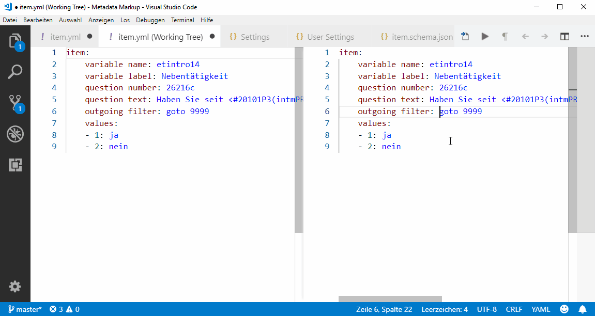

# Markup language for metadata in longitudinal studies

> In den letzten Jahren wurde die Lücke zwischen maschinen und menschen lesbaren Formaten immer kleiner. Es zeichnet sich immer mehr ein Wandel hin zu einer hybridsprache ab, die beiden Welten gerechnet wird. War bis vor einigen Jahren noch XML als Auszeichnungssprache noch das Maß aller Dinge, findet man immer mehr Anwendungen, die auf Sprachen setzen, die einfacher für den Menschen lesbar und bearbeitbar sind. Mit YAML als Obermenge von dem JSON Format findet man heutezutage ein Format, das durch seine Vereinfachung des Sprachumfangs nochmals zu einer deutlichen Steigerung der Lesbarkeit führt. Da Metadaten aus den Befragungen des NEPS in dieser einfachen Sprache ausdrücken lassen, sollten Formate wie YAML für die Dokumentation und die maschinelle Weiterverarbeitung mehr Bedeutung bekommen. Montan wird anstelle von maschinell lesbaren Format Word verwendet, das nur schwer syntaktisch und semantisch von Maschinen geprüft und weiterverarbeitet werden kann.

## Einleitung

Bisher wird hauptsächlich Word als Arbeitsmittel für die Item-Entwicklung verwendet. Word ist ein geschlossenes System und hat daher zwei große Nachteile:

 1. Keine Validierung der Eingabe möglich: Word ist von Maschinen nur sehr schwer einlesbar, da es nicht erlaubt Inhalte semantisch auszuzeichnen. Selbst wenn ein Mensch in der Lage ist eine gewisse Struktur in den Texten zu erkennen, bleibt es für Maschinen nur Text mit Formatierung. Ob die Inhalte eine gewollte Struktur aufweisen kann in Word nicht validiert werden. Die bislang verwendete Wordvorlage gibt zwar eine Struktur vor, die Kontrolle kann aber nur händisch erfolgen.  
 2. Veränderungen zwischen Versionen schwer kontrollierbar: Ein automatischer Vergleich von zwei Word-Dokumenten ist nicht möglich, so dass bei Kontrollschleifen und Änderungen momentan Farben verwendet werden.

Das kurzfristige Ziel sollte daher sein die Validierung der Vorlagen zu ermöglichen und ein Umfeld zu schaffen in der Veränderungen eines Dokuments jederzeit nachvollziehbar sind. Als Strategie dieses Zeil zu erreichen, würde es sich anbieten die bisherige Word-Vorlage in ihrer Grundform zu belassen. Die bisherige Tags könnten als Labels weiterverwendet werden, auch wenn die verwendeten Abkürzungen nicht zur Lesbarkeit der Programmierung führt, man muss sie lernen um ihre Bedeutung zu verstehen. In der Welt der Softwareentwicklung versucht man sprechende Namen für Labels zu verwenden [("Martin", 2009)](#cleancode). Die Umstellung würde daher zunächst einen Wechsel des Arbeitswerkzeuges bedeuten, die Verwendung eines Textformats, das sowohl von Menschen als auch von Maschinen gelesen werden kann. In vielen Softwareprojekten hat sich bei ähnlichen Zielvorstellungen das Format YAML etabliert, das im Folgenden genauer vorgestellt werden soll. 

## YAML
YAML ist ein Datenserialisationsformat [("The Official YAML Web Site", 2018)](#yaml). Yaml ist ein rekursives Acronym, das ein wenig selbstironisch anmutet. Es steht für `YAML ain´t markup language` und stellt sich somit bewusst gegen andere Auszeichnungssprachen wie XML. Die Stärke dieses Formats ist die Lesbarkeit für Menschen und ein umfangreicher Sprachumfang. Im Kern kann man mit YAML zwei Dinge ausdrücken, eine Liste oder einzelne Werte.

Eine Datei kann mehrere Dokumente enthalten die durch `---` eingeleitet werden. Listenelemente werden mit `-` ausgezeichnet, Werte mit `<name>: <wert>` Der Inhalt einer YAML-Datei kann zum Beispiel folgenden Inhalt haben:

    --- 
    item:
     va: etintro14
     vb: Nebentätigkeit
     fn: 26216c
     fr: Haben Sie seit <#20101P3(intmPRE/intjPRE)> noch einen bezahlte Nebentätigkeit ausgeübt?
     af: goto 99999
     we: 
       - 1: ja
       - 2: nein

Eines der wenigen erweiterten Ausdrücksmöglichkeiten von YAML ist die Verwendung von Labels und Verweisen auf diese. Ein Element in YAML kann mit Hilfe von `&<label>` gekennzeichnet werden und dann mit `*<label>` wieder darauf referenziert werden. Um die Definition des Items an einer anderen Stelle wieder zu verwenden könnte man sie daher auch folgendermaßen definieren:

    --- 
    item: &26216c
     va: etintro14
     vb: Nebentätigkeit
     fn: 26216c
     fr: Haben Sie seit <#20101P3(intmPRE/intjPRE)> noch einen bezahlte Nebentätigkeit ausgeübt?
     af: goto 99999
     we: 
       - 1: ja
       - 2: nein
 
An einer anderen Stelle kann man dann mit `*26216c` wieder auf die Definition dieses Items wieder zugreifen. Um die Lesbarkeit weiter zu erhöhen bietet es sich an die Abkürzungen des Wordvorlage auszuschreiben:

    --- 
    &26216c item: 
     variablenname: etintro14
     variablenbezeichnung: Nebentätigkeit
     fragenummer: 26216c
     frage: Haben Sie seit <#20101P3(intmPRE/intjPRE)> noch einen bezahlte Nebentätigkeit ausgeübt?
     ausgangs filter: goto 99999
     wertelabels: 
       - 1: ja
       - 2: nein
       
Man kann sich auch überlegen die Labels in englischer Sprache zu verwenden um es internationaler bewerben zu können:

    --- 
    &26216c item:
     variable name: etintro14
     variable label: Nebentätigkeit
     question number: 26216c
     question text: Haben Sie seit <#20101P3(intmPRE/intjPRE)> noch einen bezahlte Nebentätigkeit ausgeübt?
     outgoing filter: goto 99999
     values: 
       - 1: ja
       - 2: nein

## Erstellung eines YAML Dokuments
Hier soll noch einmal darauf hingewiesen werden, dass ein YAML Dokument reiner Text ist und somit in jedem Texteditor bearbeitet werden kann. Durch die enorme verbreitung dieses Formats in den Softwareentwicklung gibt es aber auch spezielle Texteditoren, die die Erstellung eines syntaktisch richtigen YAML-Dokuments unterstützen können. Es empfiehlt sich einen der folgenden Editoren zu verwenden

* [Visual Studio Code](https://code.visualstudio.com/) (VSCode): Freier Texteditor mit guten Plugins für die Erstellung und Korrektur von YAML Dokumenten. 
* [Atom](https://atom.io/): Beliebter Texteditor, ebenfalls mit der Möglichkeit den Sprachumfang durch Plugins um YAML zu erweitern.

## Schemabeschreibung mit einem YAML language server
Die vorgestellten Editoren können zwar die grundlegende Form des Yaml überprüfen einen echten Mehrwert beim Wechsel von Word erreicht man allerdings erst, wenn man Hilfestellung bei der Erstellung des gewünschten Zielformats bekommt. Man muss also zunächst das Format selbst beschreiben. Es gibt für diesen Zweck Metasprachen in denen man das korrekte Zielformat definieren kann. Diese können über sogenannte Language Server in die Editoren eingebunden geben und vermitteln so einen guten Ausblick auf den Komfort den man durch den Umstieg erreichen kann.  

### Unterstützung beim Erstellen von Instrumenten 
Mit Hilfe der Beschreibung des Formats können die Texteditoren bereits zwei wichtige Unterstützungen bei der Erstellung von Instrumenten liefern: Autovervollständigung und Fehlerkontrolle.

Autovervollständigung bedeutet, dass der Editor in der Lage ist aus der Beschreibungsdatei Texte selbstständig zu vervollständigen. Diese Vervollständigung funktioniert sogar für komplexe Elemente, wie einem kompletten Item: 

  
  *Autovervollständigung von Strukturen aus der Beschreibungsdatei*

Eines der wichtigsten Eigenschaften von Beschreibungsdokumentation ist es Fehler im Dokument zu erkennen und zu benennen. In diesem Beispiel wird das obligatorische Element `variable label` entfernt und der Editor ist in der Lage das Fehler mit der Meldung `Missing property "variable label"` zu benennen.
  
    
   *Syntaxfehler für obligatorische Felder*

### Vergleichbarkeit von unterschiedlichen Versionen

Ein großer Vorteil von YAML liegt in der guten Verwendbarkeit innerhalb von Arbeitsweisen, die sich auch in der Softwareentwicklung etabliert haben. Da YAML ein reines Textformat ist lässt es sich ausgezeichnet innerhalb eines Versionskontrollsystem verwenden. Dies bringt auch den Vorteil gemeinsam in einem kontrollierten Umfeld an einem Dokument zu arbeiten und der Vergleichbarkeit von verschiedenen Versionen. Manche Editoren bringen beide Möglichkeiten bereits mit, so wie zum Beispiel Visual Studio Code.

  	
  *Vergleich von verschiedenen Versionen*

## Zusammenfassung
Wir haben illustriert, wie ein strukturiertes Format für die Entwicklung von Erhebungsinstrumenten aussehen kann und welche Vorteile es gegenüber dem bestehenden Word-Format bringt: Bei YAML handelt es sich um ein reines Textformate, es kann das entstehende Dokument in jedem einfachen Texteditor geöffnet, gelesen und verändert werden. Durch die Maschinenlesbarkeit gibt es aber heute schon genügend Texteditoren, die mit Syntaxhighlighting und Autokorrekturen die Bearbeitung unterstützen können.
Der größte Vorteil eines maschinenlesbaren Formats liegt allerdings in der Verwendung in einem gut organisierten Bearbeitungsprozesses, wie man ihn unter dem Stichwort Application Lifecycle Management (ALM) in der Softwareentwicklung kennt. 

## Ausblick 
Der Wechsel auf ein machinenlesbares Format wie YAML dreht an zwei entscheidenden Stellschrauben im Prozess der Instrumentenentwicklung, es ist maschinenlesbar (also auch syntaktisch überprüfbar) und kann von Versionskontrollsystemen versioniert werden. Um diesen noch recht einfachen Wechsel der Formate sollte allerdings ein Ecosystem aus verschiedenen Softwaretools etabliert werden, die es der Zielgruppe ermöglicht mit diesem Format Fragebögen zu entwickeln ohne dass man sich zu sehr mit der darunterliegenden Technik auseinandersetzen zu müssen. Mögliche Entwicklungen schließen auch gute Recherchetools mit ein, die aus den bisherigen Metadaten Grundbausteine für einen neuen Fragebogen im YAML Format für den Instrumentenentwickler "setzt" und er bestehende Bausteine nicht noch einmal selbst schreiben muss. Konkreter formuliert muss ein Tool das bisherige Copy-Paste zwischen zwei Worddokumenten ersetzen, in dem es aus der Metadatenbank die bestehenden gut dokumentierten und abgenommenen Inhalte zugänglich macht. Eine weitere Entwicklung muss die Versionierung der Dokumente transparent machen. Zwar lässt sich die Versionierung eines Textdokuments sehr einfach technisch lösen, allerdings sind Versionskontrollsysteme für Menschen ohne Technischen Hintergrund mit hohen Einstiegshürden verbunden. Dies sollte ebenfalls mit einem geeigneten Tool und einer zielorientierten Oberfläche, die näher an den bisherigen Prozessen orientiert ist, gelöst werden.

## Literatur
Martin, R. C. (2009). Clean code: A handbook of agile software craftsmanship. Upper Saddle River, NJ: Prentice Hall.

The Official YAML Web Site (2018, September 25) Retrieved from http://yaml.org/